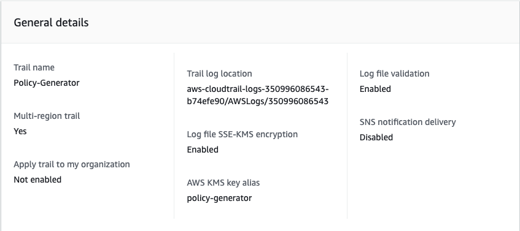
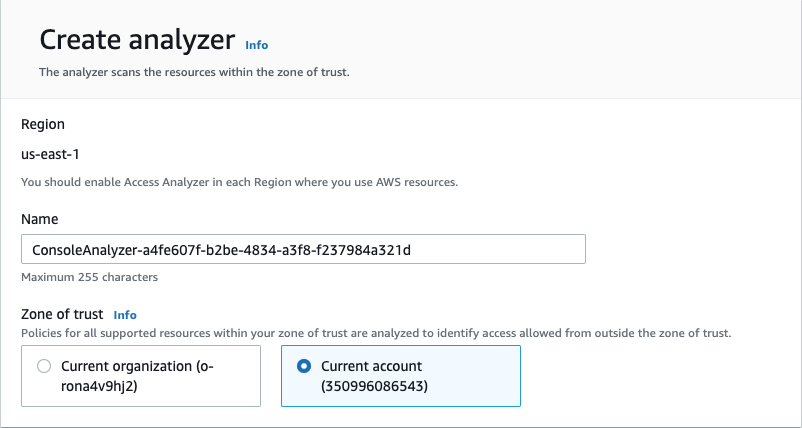
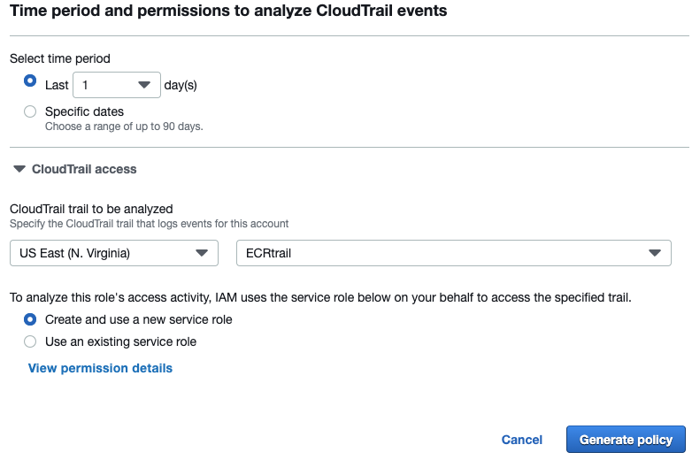

# CDK Policy Generator
Process for generating a restrictive permissions policy that can be used for a specific CDK stack. Utilizes AWS's Access Analyzer to review CloudTrail activity.

## AWS Setup

- Create an AWS role with admin permissions (this will ensure that the stack does not encounter any permissions issues during deployment)
- Create a CloudTrail for the account containing the AWS admin role. Select 'Management events' under **Events** and 'Read' and 'Write' under **Managment events**. Ensure 'Multi-region trail' is enabled

- Create an IAM Access Analyzer through the IAM console by selecting 'Access analyser' under **Access reports** and then clicking the 'Create analyzer' button. Use the account containing the admin role as the zone of trust

- The first time a policy is generated you will also need to create a new service role. Navigate to your role in the IAM console and select 'Generate policy' at the bottom of the page. Select a time period of one day, the CloudTrail you previously set up, and create and use a new service role. This will generate a blank policy but will create the service role needed.


[IAM Access Anaylzer policy generation](https://docs.aws.amazon.com/IAM/latest/UserGuide/access-analyzer-policy-generation.html)

## GitHub Workflow
Below is a github workflow that utilizes the aws resources set up above. It uses OIDC to allow the github workflow to assume the admin role created in the previous steps (see [OIDC_Process](https://github.com/NASA-IMPACT/Caden_Lessons_Learned/blob/main/OIDC_Process.md) for instructions on setting this up). From here it installs the aws CDK, records the start time, deploys and destorys the CDK app, starts policy generation, waits for it to finish, and returns the resulting policy once generated. Note that on occasion the policy generator will generate a blank poliocy. In these instances you will need to run the workflow again. Additionally, the policies generated may not always be complete. These are to be used as a starting point for further testing.

``` yaml
name: CDK Policy Generator
on:
  workflow_dispatch:
env:
  AWS_REGION : "<AWS-region>"
## These permissions are required for OIDC connection  
# permission can be added at job level or workflow level    
permissions:
  id-token: write   # This is required for requesting the JWT
  contents: read    # This is required for actions/checkout
jobs:
  CDK_deploy_destroy:
    runs-on: ubuntu-latest
    steps:
      - name: Git clone the repository
        uses: actions/checkout@v3
      - name: Configure aws credentials for <role-name>
        uses: aws-actions/configure-aws-credentials@v1-node16
        with:
          role-to-assume: arn:aws:iam::<account-id>:role/<role-name>
          role-session-name: <role-session-name>
          aws-region: ${{ env.AWS_REGION }}
      - name: Python Install
        uses: actions/setup-python@v4
        with:
          python-version: '3.10' 
      - name: Install AWS CDK v2
        run: npm install -g aws-cdk@2.x
      - name: Check CDK Version
        run: cdk --version
      - name: Install requirments
        run: pip install -r requirements.txt
      - name: Record start time
        run: |
          start=$(date +%s)
          echo "start=$start" >> $GITHUB_ENV
      - name: Deploy CDK app
        run: cdk deploy
      - name: Destory CDK app
        run: cdk destroy --force
      - name: Start policy generation
        run: |
          end=$(date +%s)
          output=$(aws accessanalyzer start-policy-generation \
          --policy-generation-details '{
            "principalArn": "arn:aws:iam::<account-id>:role/<role-name>"
          }' \
          --cloud-trail-details '{
            "accessRole": "arn:aws:iam::<account-id>:role/<role-name>",
            "endTime": '$end',
            "startTime": '${{ env.start }}',
            "trails": [
              {
                "allRegions": true,
                "cloudTrailArn": "arn:aws:cloudtrail:us-east-1:<account-id>:trail/<Trail-name>",
                "regions": []
              }
            ]
          }')
          jobId=$(echo "$output" | jq -r .jobId)
          echo "policy_id='$jobId'" >> $GITHUB_ENV
      - name: Check job status
        run: |
          while true; do
            result=$(aws accessanalyzer get-generated-policy --job-id '${{ env.policy_id }}')
            status=$(echo "$result" | jq -r '.jobDetails.status')
            if [ "$status" = "SUCCEEDED" ]; then
              echo "status=$status" >> "GITHUB_ENV"
              break
            fi
            echo "Waiting for the policy generation to complete, current status: $status"
            sleep 30
          done
      - name: Retrieve policy
        run: |
          policy=$(aws accessanalyzer get-generated-policy --job-id '${{ env.policy_id }}' | jq '.generatedPolicyResult.generatedPolicies[0].policy' | jq -c .)
          if [[ -z "$policy" ]]; then
            echo "Fail :("
          fi
            echo "$policy"
```
